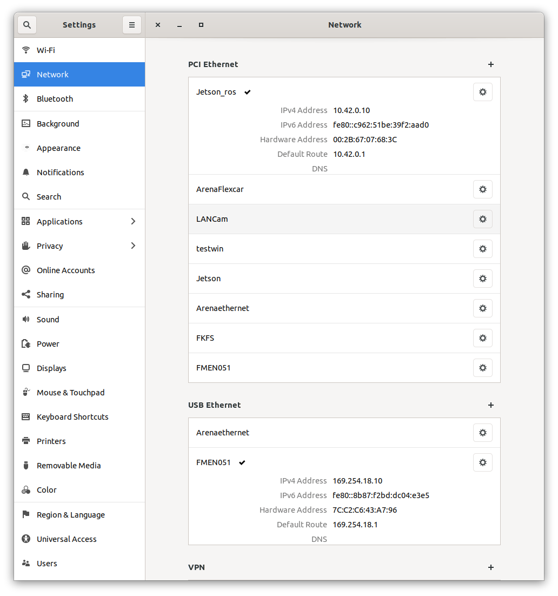
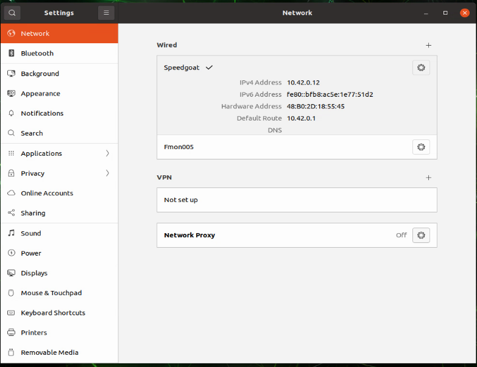

# carla ros ewolf simulation

## Hardware setup

Ethernet IP & Netmask & Gateway

- FMON005:
    - 10.42.0.10 
    - 255.255.255.0
    - 10.42.0.1
- Jetson: 
    - 10.42.0.12  
    - 255.255.255.0
    - 10.42.0.1

USB-Ethernet

- FMON005:
    - 169.254.18.10
    - 255.255.0.0
    - 169.254.18.1
- FMEN051: 
    - 169.254.18.189 
    - 255.255.0.0

FMON005 Network:


Jetson Network



## Software setup

FMON005 and Jetson use ROS2 communication per Ethernet.

FMON005 and FMEN051 use ROS2 send socket UDP per USB-Ethernet to communicate.

### check ROS2 in FMON005 and Jetson

Fmon005:
```
fmon005@fmon005:~$ echo $ROS_DISTRO 
foxy
fmon005@fmon005:~$ echo $ROS_DOMAIN_ID 
1
```

Jetson:
```
jetson@ubuntu:~$ echo $ROS_DISTRO 
foxy
jetson@ubuntu:~$ echo $ROS_DOMAIN_ID 
1
```

FMON005 run carla and carla-ros-bridge (ROS2 Foxy)
```
/opt/carla-simulator/CarlaUE4.sh 
```
```
ros2 launch carla_ros_bridge carla_ros_bridge_with_example_ego_vehicle.launch.py
```
If you want to simulate NPC in Carla Simulator
```
python /opt/carla-simulator/PythonAPI/examples/generate_traffic.py
```
If you want to simulate dynamic weather in Carla Simulator
```
python /opt/carla-simulator/PythonAPI/examples/dynamic_weather.py
```

Jetson run ewolf automated driving functions
```
ros2 run lanedet_ros2 lanedet_node --ros-args -p camera_topic:=/carla/ego_vehicle/rgb_front/image
```

YOLO TRT 2D Object Detection
```
ros2 run yolo_trt_ros2 yolo_trt_node --ros-args -p camera_topic:=/carla/ego_vehicle/rgb_front/image
```

FMEN051 run ewolf Simulink LaneFollowingAndControl


 